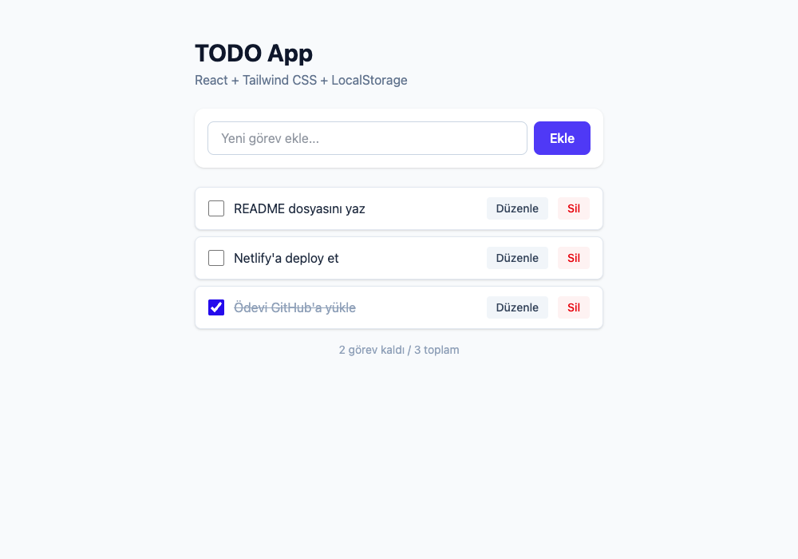

# TODO App — React + TypeScript + Tailwind CSS

Web Geliştirme / Javascript Proje Bilgisi eğitimi kapsamında hazırlanan proje ödevi. React (Vite), TypeScript ve Tailwind CSS kullanılarak geliştirilmiş, verileri tarayıcının LocalStorage'ında saklayan bir TODO (yapılacaklar listesi) uygulamasıdır.

## Ekran Görüntüsü



## Özellikler

- **Ekle**: Yeni görev ekleme
- **Listele**: Tüm görevleri listeleme
- **Güncelle**: Görev metnini düzenleme ve tamamlandı olarak işaretleme
- **Sil**: Görev silme
- Veriler `localStorage` üzerinde saklanır, sayfa yenilense de kaybolmaz

## Kullanılan Teknolojiler

- [React](https://react.dev/) (Vite ile)
- [TypeScript](https://www.typescriptlang.org/)
- [Tailwind CSS](https://tailwindcss.com/)
- LocalStorage (kalıcı veri saklama)

## Proje Yapısı

```
src/
  components/   # TodoForm, TodoItem, TodoList
  pages/        # Home
  interfaces/   # Todo veri modeli ve localStorage yardımcı fonksiyonları
```

## Kurulum

```bash
npm install
npm run dev
```

Uygulama varsayılan olarak `http://localhost:5173` adresinde açılır.

## Build

```bash
npm run build
```

## Yayına Alma (Netlify)

Proje kökünde bulunan `netlify.toml` build ayarlarını içerir (`npm run build`, çıktı klasörü `dist`). Netlify'da "New site from Git" ile bu repo seçilerek otomatik yayına alınabilir.
